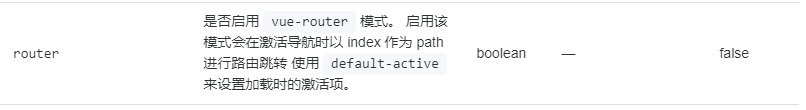

# vue3-ts-demo
本项目需要一定的知识基础，我比较熟悉java，然后每天0.5-1小时学了几天官网的vue3和typescript，大概8个小时

vue3官网：https://cn.vuejs.org/guide/essentials/application.html

在介绍项目的同时，也列出了用到的知识点，毕竟官网看的时间太短，很多还需要在实战中不断回顾官网

还有一个重要的组件：element-plus：https://element-plus.org/zh-CN/

遇到问题多看日志！遇到问题多看日志！遇到问题多看日志！

日志可在页面consle查看

##基础知识
###创建选项：

怎么知道是否是ts项目：

可以看到项目和之前略有不同，msin.js和jsconfig.json变成了msin.ts和tsconfig.json，
当然你可以创建普通项目手动更改，但是我目前初学阶段，但是之前这样处理出现了一些问题

###安装vue插件
package.json是所有插件管理处，类似java的Maven
你可以在项目下用terminal命令行安装，自动添加到package.json，
也可以直接在package.json理添加插件，右键执行run install一键安装所有插件
### idea vue 小知识
可以新建一个vue component会帮你建一个带有模板的vue文件

模板可以再settings->file and code templates里面修改或者自定义新的模板类型

##项目讲解
###引入element-plus

element官网：https://element-plus.org/zh-CN/guide/quickstart.html

安装：npm install element-plus --save
然后再 main.ts 引用后即可使用

##项目
先写一个基础的

###登录表单

1. 先去element-plus找到符合的Form（里面有各种类型和js函数），先运行项目看是否能访问，访问不了大概率是router或引包的问题
2. 找到copy的样式template代码，对页面稍作修改，删除不用的按钮输入框，修改页面展示和model字段名称
3. 修改script代码块，先修改规则校验模块，form表单头的：rules就是对应这里的变量rules，对变量进行自定义校验规则
4. ：model数据传输和定义，定义表单提交事件submitForm（我理解model->java对象,submitForm->接口实现），这样理解就快很多
5. 调用后端接口，此处用mock即可,后端接口可以封装为ts（可以在axios全局配置请求拦截和响应拦截器）
6. 获取返回值判断成功则添加token，失败则弹框
7. 加一些css样式优化界面
8. 待处理，增加接口返回错误后显示登录失败

###页面布局
1. 先找一个container布局容器样式copy到主页面，里面有aside，header，main等
2. header网上找的，侧边栏aside用的官网的menu菜单（需删除无用代码），然后改造容器布局样式
3. 把我们自己的header和aside写成两个vue组件，然后在homevue里面引用组件（代码更有阅读和复用性）
4. aside，header，main组件的样式会与container的样式冲突？页面会重叠，删除容器或组件的div样式就好了
5. 同时我们的展示页面其实是在容器页面里的，在一个页面里面有一个子页面，渲染子页面需要注册子路由children
6. 修改侧边栏代码，由homeview传参，具体看两部分代码,以下是大致描述
7. 引用组件时先传参，并定义变量，在js里主要是通过route配置获取配置信息然后赋值给变量
8. 设置路由出口,<el-menu>有一个router参数，官网有描述，这个一定要开启，要不无法跳转，然后页面展示处添加<router-view></router-view>设置路由出口即可

   
###  子路由展示内容
1. 导航和页面整体布局已经完成，开始编辑页面
2. 一个查询表单，表单有查询和分页信息表单提交（数据少可以全查前端分页，好像也挺流行）
3. 一个展示的table，标注列名和字段即可（是否可以自动？）

### 路由守卫和拦截
```
router.beforeEach((to, from, next) => {
  const token: string | null = localStorage.getItem("token")
  if(!token && to.path !== "/login"){
    next("/login")
  }
  else{
    next()
  }
})

//请求拦截
service.interceptors.request.use((config) => {
    config.headers = config.headers || {}
    if(localStorage.getItem("token")){
        config.headers.token = localStorage.getItem("token") || ""
    }
    return config
})
```

### 知识点

知识点讲解：v-bind
1. v-bind的缩写是：，主要是动态绑定属性，所以接下来需要处理一下:model和:rules，
2. 流程就是：const定义一个变量rules，返回值返回变量return{rules}，就可以在表单动态进行数据交互了

知识点讲解：reactive，ref，toRef，toRefs
1. 响应式是指当数据改变后，Vue 会通知到使用该数据的代码。例如，视图渲染中使用了数据，数据改变后，视图也会自动更新。
2. ref 源数据的值不会被更改，并且数据变化会立马改变HTML
3. reactive 响应式的对象值改变了，原有的数据也会被改变。HTML视图也会实时更改
4. toRef 抽离响应式对象（被reactive包裹的对象）中的某一个属性的，并且把这个属性包裹成ref对象，使其和原对象产生链接
5. toRefs 批量版的toRef

知识点讲解：setup语法糖
```
<script lang="ts" setup>
可以省略defineComponent和setup，return返回值一系列操作，代码更简洁
```

知识点讲解：fastmock
1. 模拟后端接口返回值，方便前后端链联调或者测试的工具

知识点讲解：浏览器token设置
```
//登录后设置token
calStorage.setItem("token", res.data.token)
```
知识点讲解：接口调用和返回值
```java
//第一种
 this.$axios
      .post('/login', {
        username: this.loginForm.username,
        password: this.loginForm.password
      })
      .then(res => {
        if (res.data.code === 200) {
        }
      })
// 或者更简洁友好的方式
service({
  url: "/login",
  method: "POST",
  data
})
```

知识点：组件嵌套和使用
```aidl
import TopNav from '@/components/TopNav.vue' //第一步引入,注意ts不写后缀，vue要写
components: {TopNav} 在js中设置该组件
<TopNav/> //使用
```

知识点：页面嵌套
和组件嵌套是不一样的

知识点:props配置项
1. 组件之间的通信，或者理解为接口的参数，我在组件里定义好参数变量，使用时可以传参方式修改变量

知识点讲解：动态路由router
路由还可以设置children子路由，获取路由信息router.getRoutes()即可获取所有子路由，就可以实现动态路由了


### 项目运行bug:
1. 突然遇到引用的插件劝导说找不到moudle，试了一些方法也没解决，感觉大概率npm插件时导致包冲突
2. 看了网上修改shims-vue.d.ts文件名为sfc.d.ts，解决了，原因未知
3. 有报错 has no exported member 'reactive'. Did you mean 'Directive'?，包冲突了
4. 只能把文件名改回去，然后重启ide就好了，之前的报错也没了，怀疑是npm导致一些问题后面因为缓存报错的

查bug
只要项目运行起来，进到页面，打开页面控制台都会显示错误信息
